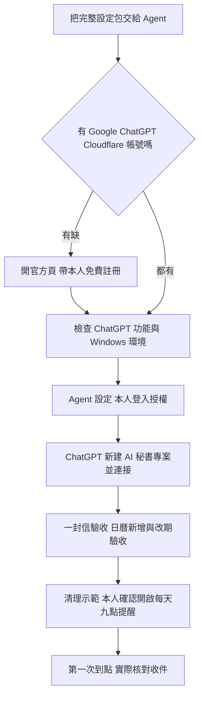

# 安裝與日常流程

| 你想做什麼 | 秘書怎麼做 |
|---|---|
| 交辦或更新待辦 | 讀取目前進度，保存後讀回 |
| 安排行程 | 查指定日曆、檢查撞期，提出時間 |
| 確認行程 | 再查一次，確認無新衝突後寫入並讀回 |
| 每天看提醒 | Cloudflare 在台灣 09:00 寄一封 Gmail，分類待辦與今日行程 |
| 完成一步 | Gmail 勾選保存；ChatGPT 讀到同一份最新進度 |

本人密碼、Google 與 Cloudflare 的登入授權由本人操作。Agent 不需要看到密碼。詳細命令留在 [Agent 手冊](../setup/助手交接指示.txt)，你只需看 [12 步圖解](AI秘書完整操作圖解.pdf)。
