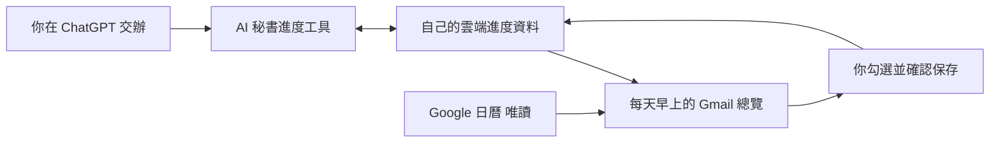

# AI 秘書完整流程

使用者提供自己的帳號與必要確認；agent 執行設定包。八個階段與 HTML 技術手冊一致。

| 階段 | Agent 完成 | 本人確認 |
|---|---|---|
| 1 前置檢查 | 環境、功能檢查、離線測試、填設定 | 自己的帳號與兩個 Gmail |
| 2 雲端服務 | 建資料庫、部署、讀回首頁與狀態 | Cloudflare 登入及授權 |
| 3 Google | 準備設定、匯入本機憑證、驗證帳號 | 寄件與日曆分別授權、長期使用設定 |
| 4 ChatGPT | 準備連線網址、專案指示與一次性連線 | 連線與新專案、聊天讀寫驗收 |
| 5 Gmail | 引導核對動態郵件與寄件地址 | 自己的 Gmail 畫面與儲存 |
| 6 驗收 | 預覽、核對後寄一封信、查回狀態 | 收到信、勾選保存、關掉重開 |
| 7 日常與清理 | 演練下一步、取消兩筆教材示範、讀回 | 確認沒有遺留練習待辦 |
| 8 每日提醒 | ready-check、部署每日 09:00、核對排程 | 明確啟用、首次到點確認收件 |

## 日常資料如何流動

提醒只依已保存的待辦與指定日曆生成，不會自行從所有聊天猜下一階段。修改待辦前先查回目前版本，更新後再查回；不因期限到了就判定完成。

## 驗收順序

使用固定的教材練習 ID：新增 → 同一筆改期 → 確認只一筆 → 預覽 → 一封驗收信 → 勾選保存 → 關閉重開 → 聊天讀回 completed → 下一封預覽排除 → 示範下一步 → 取消教材兩筆 → 啟用每日。

驗收信一天最多一封。completed 不改回 pending 來補拍；預覽沒有寄信，離線測試也不代表 Gmail 已收信。第一次到點收信在時間真正到達後確認。
